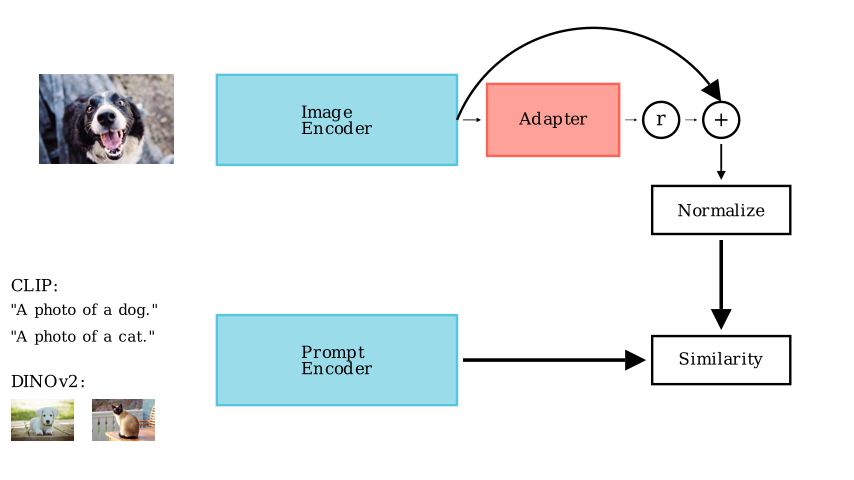
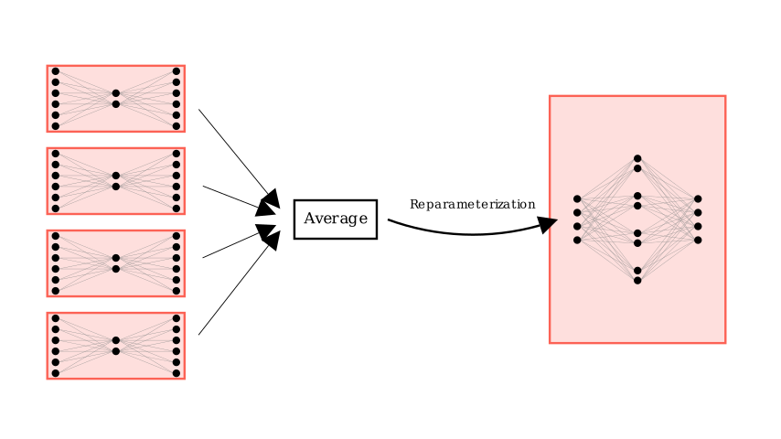

# Soup-Adapter: Robust Few-Shot Domain Adaptation with Adapter Ensembles

## Overview

This project implements **Soup-Adapter**, a method for robust and practical few-shot domain adaptation with foundation models such as **CLIP** and **DINOv2** based on **CLIP-Adapter**.

**Key contributions:**
- **Hyperparameter-free performance:** Hyperparameter tuning is often impractical in few-shot learning due to the lack of large validation sets. Soup-Adapter addresses this by averaging multiple adapters trained with diverse hyperparameters, reducing the need for tuning.
- **Robustness to distribution shifts:** Test data may differ from the training distribution. Our ensemble method is more robust to such shifts than any single adapter.
- **Residual ratio insensitivity:** The ensemble is significantly less sensitive to the residual ratio—a critical CLIP-Adapter hyperparameter.
- **Adapter reparameterization:** The ensemble can be merged into a single adapter via principled parameter concatenation.
- **First direct comparison:** This is the first study to apply and compare CLIP adapter-style techniques to both CLIP and DINOv2.

- **Schematic visualization of CLIP-Adapter:**
- 

- **An ensemble of CLIP-Adapters can be reparameterized to a single one as follows:**


- **Such Soup-Adapters have favorable tradeoffs in terms of hyperparameter tuning, accuracy and robustness under distribution shifts**
## Installation

You can install all required dependencies with:

```
    pip install -r requirements.txt
```

If you prefer manual installation, follow these steps: 
```
    pip install torch torchvision torchaudio
```
    
1. **Install PyTorch and related libraries** (see [PyTorch installation instructions](https://pytorch.org/get-started/locally/)) for your hardware and OS:

    - Install pytorch torchvision torchaudio using the correct command from https://pytorch.org/get-started/locally/

2. **Install required Python libraries:**

    ```
    pip install pytorch-lightning mlflow matplotlib pandas clip
    ```

**Install ImageNetV2 loader:**

```
    pip install git+https://github.com/modestyachts/ImageNetV2_pytorch
```

## Data Setup

Follow the instructions in **https://github.com/gaopengcuhk/Tip-Adapter/blob/main/DATASET.md** to setup the data except ImageNet

# ImageNet directory structure:

### ImageNet Data Directory Structure

Your ImageNet data should be organized with the following directory structure, where each split (e.g., `train`, `val`, `imagenet-a`, `imagenet-r`, `sketch`) contains subfolders for each class, and each subfolder contains the images for that class:

```text
imagenet/
    train/
        class1/
            img1.jpg
            img2.jpg
            ...
        class2/
            img1.jpg
            ...
        ...
    val/
        class1/
            img1.jpg
            ...
        class2/
            ...
        ...
    imagenet-a/
        class1/
            img1.jpg
            ...
        ...
    imagenet-r/
        class1/
            img1.jpg
            ...
        ...
    sketch/
        class1/
            img1.jpg
            ...
        ...
```


- **`train/`**: Contains training images organized in subfolders, one per class.
- **`val/`**: Contains validation images, also organized by class.
- **`imagenet-a/`**, **`imagenet-r/`**, **`sketch/`**: These are additional distribution shift benchmarks, each structured the same way, with images sorted into class-named subfolders. These can be downloaded from https://github.com/hendrycks/natural-adv-examples, https://github.com/hendrycks/imagenet-r, https://github.com/HaohanWang/ImageNet-Sketch

**Each class subfolder should be named exactly as the class label.**  
This structure is compatible with PyTorch and torchvision dataset loaders.


## Usage

- To create the figures from the paper, run
```
    python results.py
```
- To reproduce the results of the paper, first store the features for reuse
```
    bash cache_prompts_clip.sh ViT-B/32 2
    bash cache_prompts_clip.sh ViT-B/32 4
    bash cache_prompts_clip.sh ViT-B/32 8
    bash cache_prompts_clip.sh ViT-B/32 16
```
```
    bash cache_prompts_dinov2.sh dinov2_vits14 2 1
    bash cache_prompts_dinov2.sh dinov2_vits14 4 1
    bash cache_prompts_dinov2.sh dinov2_vits14 8 1
    bash cache_prompts_dinov2.sh dinov2_vits14 16 1
```
```
    bash cache_dataset.sh dinov2_vits14
    bash cache_dataset.sh ViT-B/32
```
- You can then run the scripts in ./scripts/ folder
- To run the run_all.sh file, you also need to store the imagenet features for the dinov2 model dinov2_vitb14_reg, and the clip model ViT-B/16
- To reproduce the results for larger architectures, the corresponding features have to be stored. You can then run
```
    bash ablate_large.sh
```
- This can cause freezes on many machines, because the dinov2 ViT-G model is very large.
- You can instead run
```
python big_model_eval.py
```
instead to create compute these results from the stored checkpoints in this repository
## Citation

If you use this code, please cite our paper:

